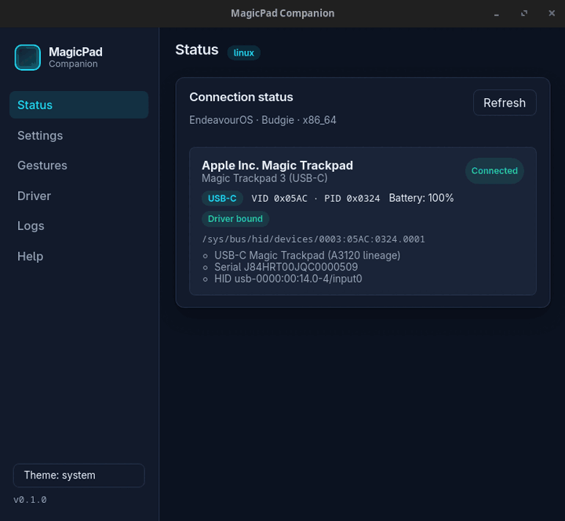
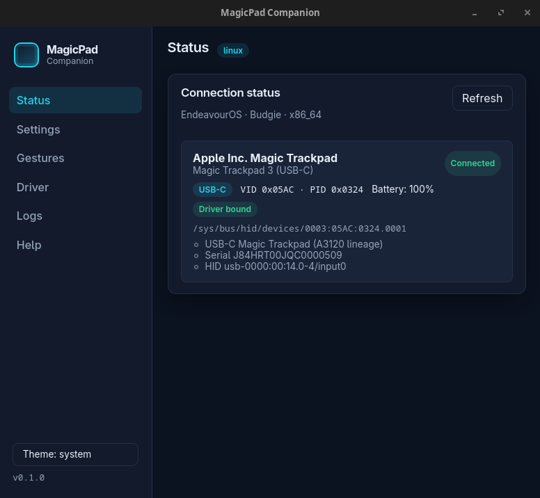
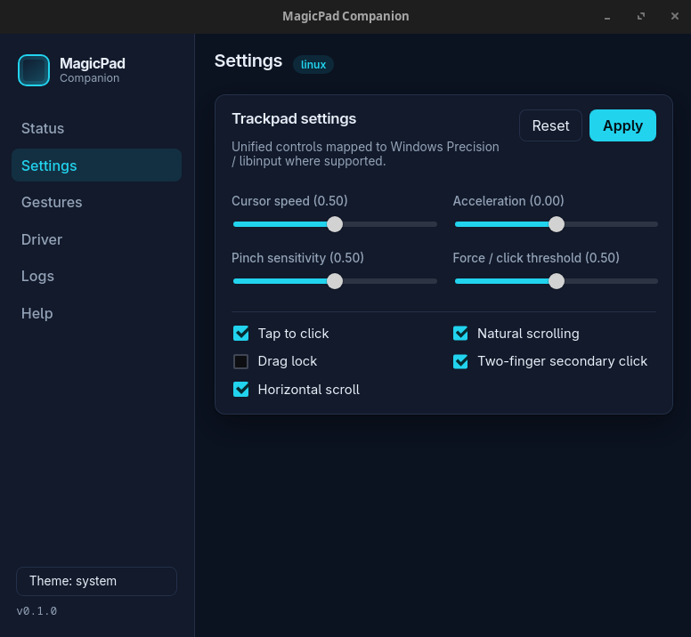
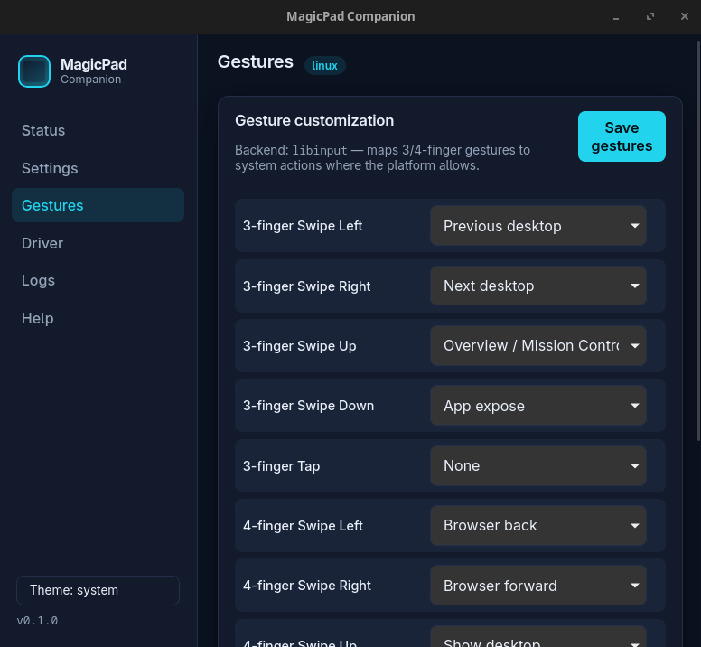
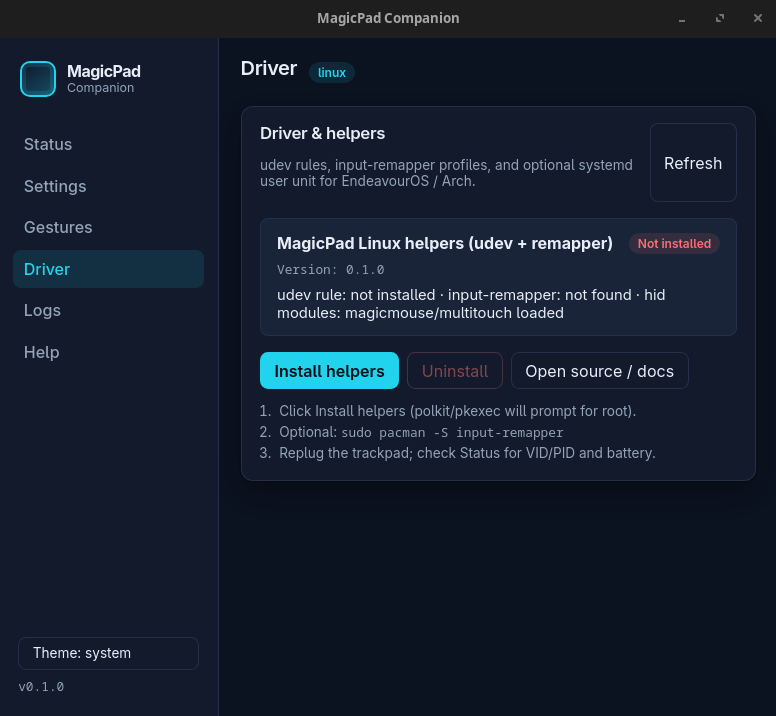
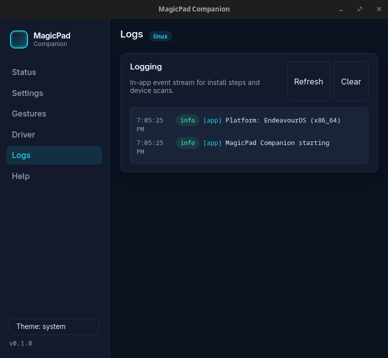
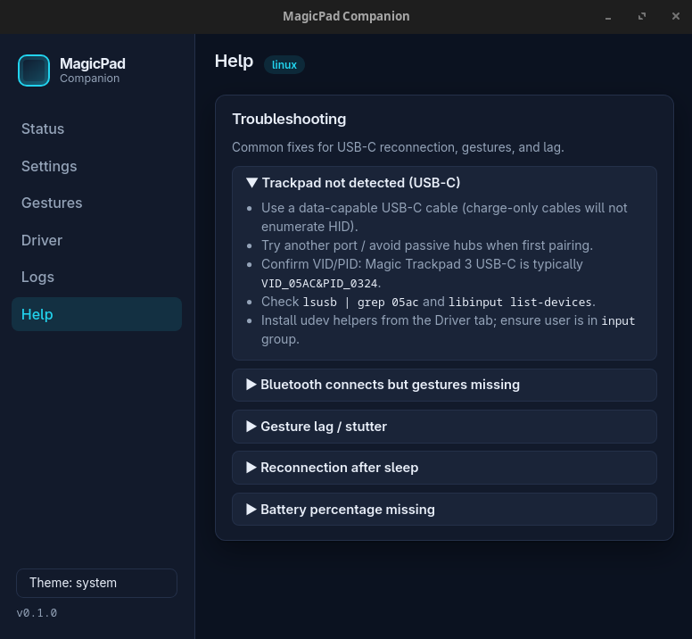

# MagicPad Companion

Cross-platform companion for the **Apple Magic Trackpad 3 (A3120, USB-C)** and earlier Magic Trackpad 1/2 models.

**Windows 11** — Precision Touchpad gestures, USB-C + Bluetooth, battery awareness, one-click driver install hooks.  
**EndeavourOS / Arch Linux** — libinput-oriented settings, udev helpers, input-remapper profiles.  
**Other Linux / macOS** — graceful degradation (status, local settings, docs).

Built with **Rust + Tauri 2 + Svelte**.

---

## Architecture (summary)

```
Svelte UI  ──invoke──►  Tauri commands  ──►  TrackpadBackend trait
                                              ├── Windows (SetupAPI, pnputil, PTP)
                                              ├── Linux   (sysfs, udev, remapper)
                                              └── macOS   (status-only)
```

Full design: **[ARCHITECTURE.md](./ARCHITECTURE.md)**

### Driver strategy

| Platform | Approach |
|----------|----------|
| Windows | Wrap/install [vitoplantamura/MagicTrackpad2ForWindows](https://github.com/vitoplantamura/MagicTrackpad2ForWindows) (signed, USB-C) — lineage of [imbushuo/mac-precision-touchpad](https://github.com/imbushuo/mac-precision-touchpad). Target HWID includes `VID_05AC&PID_0324`. |
| Linux | Kernel HID + `packaging/linux/99-magic-trackpad.rules` + optional input-remapper + user systemd unit stub. |
| macOS | Native OS support; app is informational. |

Driver **binaries are not vendored** in git (GPL / signing / arch). Download into the documented folder and install from the app.

---

## Features

- Detect connection status (USB-C / USB / Bluetooth)
- Real-time battery when the stack exposes it
- Unified settings: speed, acceleration, tap-to-click, natural scroll, pinch, drag lock, force threshold
- Gesture map UI (3/4-finger) with platform export
- One-click driver / udev helper install
- Dark / light / system theme
- Logging panel + troubleshooting guides
- Minimal Tauri permissions

---

## Screenshots

Live UI tour (Status → Settings → Gestures → Driver → Logs → Help):



| Status | Settings | Gestures |
|--------|----------|----------|
|  |  |  |

| Driver | Logs | Help |
|--------|------|------|
|  |  |  |

---

## Test on a home Windows PC

**You do not need to sign the trackpad drivers.** Use the Microsoft-signed upstream Precision package; MagicPad only installs what you place in a local folder.

1. **App** — grab a Windows build from [Releases](https://github.com/imcmurray/MagicPad3/releases)  
   or the latest **windows-installers** artifact under [Actions](https://github.com/imcmurray/MagicPad3/actions).
2. **Folders + checklist** (optional PowerShell helper from a clone):

   ```powershell
   Set-ExecutionPolicy -Scope Process Bypass
   .\scripts\windows-home-setup.ps1
   ```

3. **Driver** — download [MagicTrackpad2ForWindows](https://github.com/vitoplantamura/MagicTrackpad2ForWindows/releases),  
   extract `AMD64` (or `ARM64`) under `%LOCALAPPDATA%\MagicPadCompanion\drivers\`,  
   then in the app: **Driver → Install driver** (Admin once if needed).
4. Replug USB-C or re-pair Bluetooth; confirm **Status** + gestures.

Full walkthrough: **[docs/windows-install.md](docs/windows-install.md)**

SmartScreen may warn on unsigned test builds → **More info → Run anyway**.

---

## Quick start (development)

### Prerequisites

**Both platforms**

- [Rust](https://rustup.rs/) stable  
- Node.js 20+ and npm  
- [Tauri 2 prerequisites](https://v2.tauri.app/start/prerequisites/)

**EndeavourOS / Arch**

```bash
sudo pacman -S --needed rust nodejs npm webkit2gtk-4.1 base-devel \
  curl wget openssl appmenu-gtk-module libappindicator-gtk3 librsvg
```

**Windows**

- Visual Studio Build Tools (MSVC)  
- WebView2 runtime (usually preinstalled on Windows 11)

### Run

```bash
git clone https://github.com/imcmurray/MagicPad3.git
cd MagicPad3
npm install
npm run tauri dev
```

### Production build

```bash
npm run tauri build
# Linux DEB only (reliable without linuxdeploy):
npm run tauri -- build --bundles deb
# Windows (on a Windows host with MSVC):
npm run tauri -- build --bundles nsis,msi
```

Artifacts:

| Platform | Paths under `src-tauri/target/release/bundle/` |
|----------|-----------------------------------------------|
| Linux | `deb/` (primary), `rpm/`, `appimage/` (needs `linuxdeploy`) |
| Windows | `nsis/`, `msi/` |
| Binary | `src-tauri/target/release/magicpad-companion` (~6 MB stripped) |

AppImage bundling requires [linuxdeploy](https://github.com/linuxdeploy/linuxdeploy) on the PATH; DEB builds without it.

CI builds **Windows NSIS/MSI + portable EXE** and **Linux DEB** on every push to `main`.

---

## Installation guides

- [Windows 11 / home PC testing](docs/windows-install.md) — app + Precision driver  
- [EndeavourOS / Linux](docs/linux-install.md) — app + udev / remapper  
- [Troubleshooting](docs/troubleshooting.md)

### Linux helpers only

```bash
chmod +x scripts/install-linux.sh
./scripts/install-linux.sh
```

### Windows driver package fetch

```bash
./scripts/download-windows-driver.sh
# Then extract INF tree to %LOCALAPPDATA%\MagicPadCompanion\drivers\
```

---

## Project layout

```
MagicPad3/
├── ARCHITECTURE.md
├── src/                    # Svelte frontend
├── src-tauri/
│   └── src/
│       ├── commands/       # Tauri IPC
│       ├── platform/       # windows / linux / macos backends
│       ├── models.rs       # shared types
│       └── ...
├── packaging/
│   ├── linux/              # udev, systemd, remapper profile
│   └── windows/            # driver notes
├── scripts/
├── docs/
└── package.json
```

---

## Security notes

- Capability set is intentionally small (`core`, dialog, opener, process).
- Driver/helper install is **user-initiated** and elevates only when needed (`pnputil` admin / `pkexec`).
- No always-on shell or filesystem ACL beyond app config dirs.
- CSP restricts remote content.

---

## Roadmap

- [x] Architecture + Tauri 2 / Svelte skeleton  
- [x] Platform trait + Windows / Linux / macOS modules  
- [x] Device scan (SetupAPI / sysfs)  
- [x] Settings + gestures UI  
- [x] Driver / udev install hooks  
- [ ] Live battery via PTP IOCTL / HID feature reports  
- [ ] Full input-remapper schema export  
- [ ] Optional Rust gesture daemon for labwc  
- [ ] Signed Windows CI release pipeline  
- [ ] macOS IOKit device listing  

---

## License

MIT for MagicPad Companion application code — see [LICENSE](./LICENSE).

Third-party Precision drivers remain under their own licenses (typically GPL-2.0).

---

## Credits

- [imbushuo/mac-precision-touchpad](https://github.com/imbushuo/mac-precision-touchpad)  
- [vitoplantamura/MagicTrackpad2ForWindows](https://github.com/vitoplantamura/MagicTrackpad2ForWindows)  
- Linux multitouch / Magic Trackpad community kernel work  
